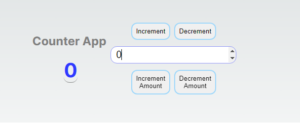

# Projeto de Estudo com Redux Toolkit



## Sobre o Projeto

Este projeto foi criado para fins de estudo e compreensão do Redux Toolkit, uma biblioteca oficial do Redux que oferece uma abordagem mais fácil e concisa para o gerenciamento de estado em aplicações React.

## Redux Toolkit

O Redux Toolkit é uma coleção de utilitários que ajudam a simplificar o fluxo de trabalho ao utilizar o Redux em aplicações React. Ele inclui a função `createSlice`, que permite definir o estado inicial e as actions de um "slice" do estado global, reduzindo consideravelmente a quantidade de código necessário para criar reducers e actions. Além disso, o Redux Toolkit também fornece o Redux DevTools e o middleware `redux-thunk` configurados por padrão, tornando o processo de desenvolvimento e depuração mais fácil e intuitivo.

## Funcionalidades

Neste projeto, criamos um contador simples para demonstrar o uso do Redux Toolkit. O contador pode ser incrementado ou decrementado por 1, ou pode ser incrementado/decrementado por uma quantidade personalizada inserida pelo usuário em um input.

## Executando o Projeto

Para executar o projeto localmente, siga os passos abaixo:

1. Clone este repositório para sua máquina local.

2. Certifique-se de ter o Node.js instalado em sua máquina.

3. Abra o terminal na pasta raiz do projeto e execute o comando `npm install` para instalar as dependências.

4. Em seguida, execute o comando `npm run dev` para iniciar o servidor de desenvolvimento. O projeto será aberto em seu navegador padrão.

## Redux Toolkit - Códigos Utilizados

Aqui estão alguns códigos que foram utilizados no projeto com Redux Toolkit:

### 1. Definindo o Slice do Reducer

```typescript
// src\components\Counter\store\counterSlice.ts

import { PayloadAction, createSlice } from "@reduxjs/toolkit";

interface ICounterState {
  value: number;
}
const initialState: ICounterState = { value: 0 };

const counterSlice = createSlice({
  name: "counter",
  initialState: { value: 0 },
  reducers: {
    increment: (state) => {
      state.value += 1;
    },
    decrement: (state) => {
      state.value -= 1;
    },
    incrementByAmount: (
      state: ICounterState,
      action: PayloadAction<ICounterState>
    ) => {
      state.value += action.payload.value;
    },

    decrementByAmount: (
      state: ICounterState,
      action: PayloadAction<ICounterState>
    ) => {
      state.value -= action.payload.value;
    },
  },
});

export const { increment, decrement, incrementByAmount, decrementByAmount } =
  counterSlice.actions;

export default counterSlice.reducer;
```

### 2. Utilizando as Actions no Componente React

```tsx
// src\components\Counter\index.tsx

"use client";

import { AppDispatch, RootState } from "@/store";
import { useDispatch, useSelector } from "react-redux";
import {
  decrement,
  decrementByAmount,
  increment,
  incrementByAmount,
} from "./store/counterSlice";
import { ChangeEvent, useState } from "react";

export const Counter = () => {
  // ...
  const dispatch = useDispatch<AppDispatch>();

  const onIncrement = () => {
    dispatch(increment());
  };
  const onDecrement = () => {
    dispatch(decrement());
  };

  const handleIncrementAmount = () => {
    dispatch(incrementByAmount({ value: valueInput }));
  };
  const handleDecrementAmount = () => {
    dispatch(decrementByAmount({ value: valueInput }));
  };
  // ...
};
```

### 3. Selecionando o Estado do Redux no Componente React

```tsx
// src\components\Counter\index.tsx

import { useSelector } from "react-redux";
// ...

export const Counter = () => {
  // ...
  const CounterSelector = useSelector((state: RootState) => state.counter);
  // ...
};

Esses são alguns códigos utilizados do Redux Toolkit no projeto. Eles ajudam a gerenciar o estado do contador e permitem que o componente Counter interaja com o Redux para atualizar o estado e renderizar o valor do contador na tela.
```
